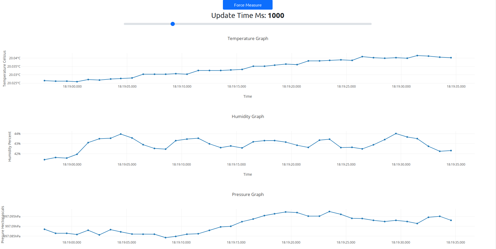

# bme280_http_server
http server communicating with udp esp32 device with bme280 sensor.

# Requirements

Flask python3 package is required to use app.
To install run:
```
pip3 install flask
```

# Usage

To run the server you have to provide esp32 device IP:
```
python3 http_server.py 192.168.1.104
```

Show options:
```
python3 http_server.py -h
```
# UI


